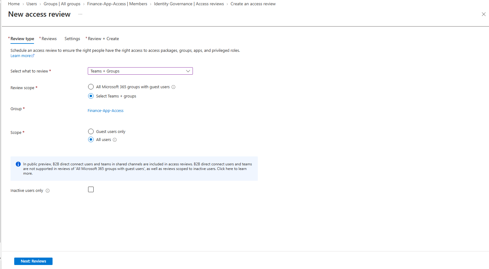
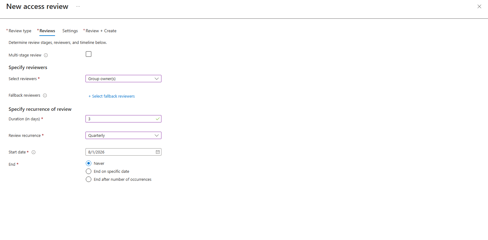
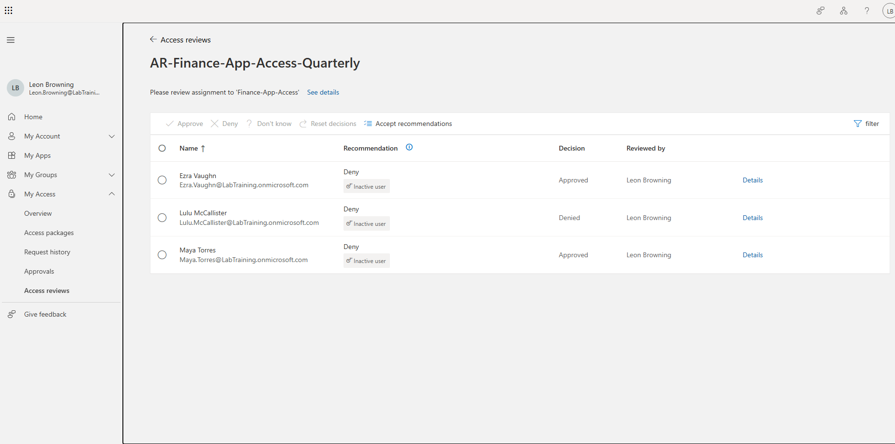
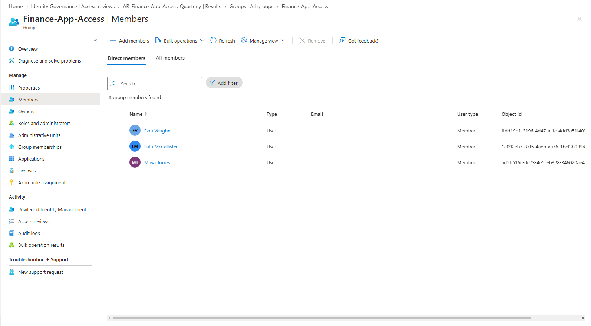
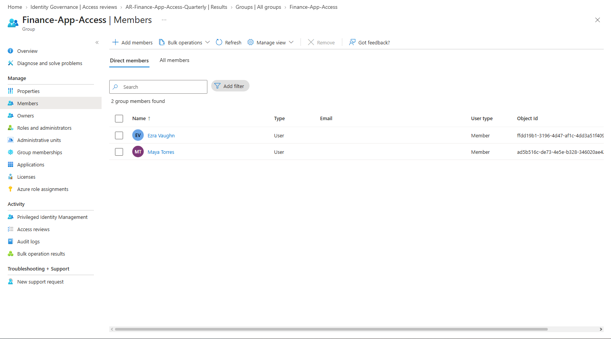
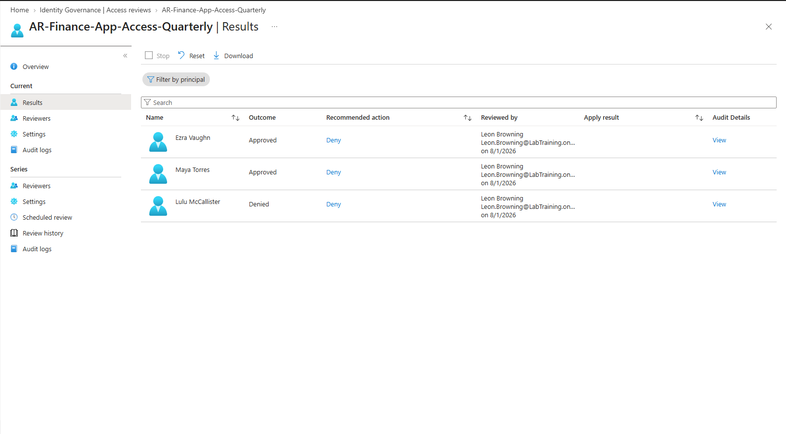

# Entra ID Access Reviews — Governing Access Over Time

Periodically certifying that people still need the access they have — the recurring, auditable control at the heart of identity governance.

---

## The Business Problem

A security group, **Finance-App-Access**, grants access to a sensitive financial system. Over time, people were added as they needed it — but nobody was ever removed. Someone who moved from Finance to Marketing a year ago still has access. A contractor whose project ended still has access.

Then an auditor asks: *"Prove that everyone with access to this system currently needs it."*

Without a process, IT can't answer that. This slow accumulation of unnecessary access is called **privilege creep**, and it's one of the biggest security and audit risks in any organization.

**Access Reviews** solve it: on a recurring schedule, a responsible reviewer certifies or revokes each person's continued access, and the outcome is enforced automatically and recorded for audit.

---

## What This Project Demonstrates

A recurring quarterly access review on the `Finance-App-Access` group, configured so that:

- The **resource owner** (not the IT admin) reviews access — enforcing separation of duties
- Each member must be explicitly **approved or denied with justification**
- Denied users are **automatically removed** from the group (auto-apply)
- Every decision is **logged with the reviewer's name and date** for audit evidence

---

## Separation of Duties — A Deliberate Design Choice

This review was **built** by the IT operator account (`it.admin`), but the **reviewer** is **Leon Browning, the Finance Manager who owns the group**.

That separation is intentional and important: the person who configures access should not be the sole person who certifies it. The resource owner — who actually knows whether their team members still need access — is the right person to make that call. This mirrors real-world governance and satisfies separation-of-duties requirements that auditors look for.

---

## How It Works

### 1. Define the Review Scope
The review targets the `Finance-App-Access` security group, scoped to **All users** in the group.

### 2. Assign the Reviewer and Cadence
- **Reviewer:** Group owner (Leon Browning, Finance Manager)
- **Recurrence:** Quarterly
- **Duration:** Configurable review window per cycle

### 3. Configure Governance Settings
- **Auto-apply results:** enabled — denied users are removed automatically on completion
- **Justification required:** enabled — every decision must be explained (audit value)
- **Decision helpers:** enabled — the system surfaces sign-in activity to inform decisions

### 4. The Reviewer Certifies Access
Leon reviews each member and records a decision with justification:

| User | Decision | Justification |
|------|----------|---------------|
| Ezra Vaughn | Approve | Still active in Finance, access required |
| Maya Torres | Approve | Confirmed still needed |
| Lulu McAllister | **Deny** | Moved to Marketing, no longer needs financial system access |

### 5. Auto-Apply Enforces the Outcome
On completion, Lulu McAllister is automatically removed from the group. Ezra and Maya remain.

---

## Human Judgment vs. Automated Recommendation

Because the lab users had no recent sign-in activity, Entra's **decision helper recommended "Deny" for everyone** and flagged them all as inactive.

The reviewer did **not** blindly accept that recommendation. Leon applied business context — approving Ezra and Maya despite the inactivity flag, and denying only Lulu based on her actual role change. This is the point of a human reviewer: **the system's recommendation is an input, not the decision.** Governance is judgment supported by data, not automation replacing it.

---

## Proof / Results

**Before the review** — `Finance-App-Access` has 3 members (Ezra, Lulu, Maya):

**After the review** — 2 members remain (Ezra, Maya). Lulu McAllister was automatically removed based on the deny decision:

The **Results** view records each outcome, the recommended action, and *"Reviewed by Leon Browning on 8/1/2026"* with per-user audit details — the documented, auditable trail that compliance frameworks require:

---

## Key Concepts

| Concept | Summary |
|---------|---------|
| Privilege creep | Access accumulating over time as roles change; the problem reviews solve |
| Separation of duties | The resource owner reviews access, not the admin who configured it |
| Auto-apply | Automatically enforce the outcome (remove denied users) on completion |
| Justification required | Forces documented reasoning — critical for audit evidence |
| Decision helpers | Surface sign-in activity to inform (not dictate) the reviewer's decision |
| Recurrence | Recurring reviews (quarterly here) provide continuous, not one-time, assurance |

*Part of an Identity & Access Management / Identity Governance portfolio. All user names are fictional; tenant details redacted from screenshots.*
